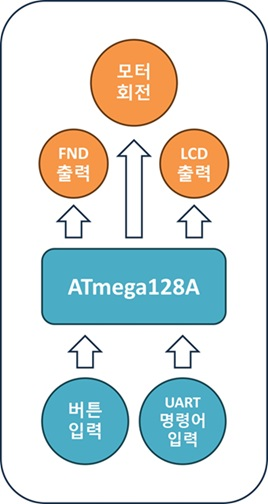

# 간이 선풍기

## 프로젝트 의의
- 강의와 실습 간에 쌓은 ***C언어 스킬***을 활용
- ATmega128 실습을 통해 얻은 ***MCU 제어 스킬***을 활용
- 주어진 키트와 주변 ***입출력 장치들***을 이용하여 아이템 구현

## 상세
### 🔖 프로젝트 명
- ATmega128을 활용하여 탁상용 선풍기 구현
### 🗓️ 작업기간 
- 24/08/07 ~ 24/08/09
### 🌐 개발환경
- Window11, Microchip Studio7, ATmega128
- [개발환경 정보](source/README.md)
### 🧰 사용 하드웨어
- Tact Switch _ 4ea 
- 16x2 LCD _ 1ea
- 4digit-7segment _ 1ea
- 5V DC Motor _ 1ea
- L298N 모터 드라이버 _ 1ea
- 330ohm 저항 _ 4ea
- 4.7ohm 저항 _ 4ea
### 🔧 사용 기술
- C 언어
- Microchip Studio & ATmega128
- 외부전원 : Power Supply 5V, 1.6A 전원 입력
- Timer/Counter 0 : FND 주사, 128분주비, Interrupt Mode
- Timer/Counter 3 : 1ms 타이머, 64분주비, CTC Mode
- 모터 PWM : Fast PWM Mode, 64분주비
- GPIO 입력 : Tact Switch 제어 입력 (4.7ohm pull-up 저항)
- GPIO 출력 : 16x2 LCD 화면 출력

### 🎮 구현 기능 소개
#### 1. 입력기능
- 정지, 풍량세기, 수면풍모드, 타이머 (스위치 4개 혹은 UART 명령어로 제어)
#### 2. 출력기능
- 모터 회전 4종 - 미풍, 약풍, 강풍, 수면풍
#### 3. 기능 설명
- 정지 : 회전 동작중인 모터를 정지
- 풍량세기 : 버튼 입력시 마다 '미풍->약풍->강풍->정지'순으로 모터를 회전
- 수면풍모드 : 별도로 구현된 회전속도로 모터를 회전
- 타이머 : 버튼 입력시 마다 3분, 5분, 7분 타이머가 동작되며, 타이머 0 도달시 모터 정지
- UART통신 기능 : 버튼 조작 외 UART 통신을 통해 1)~4) 동작을 모두 실행 가능

### 🎞️ 동작 영상
#### 1. 풍량 조절
🔉[풍량 조절 동영상 자료 링크(구글 드라이브)](https://drive.google.com/file/d/19gs8P7-rFppB3NFqyos_73Lbha8Nv4Pf/view?usp=drive_link)

#### 2. 수면풍 모드
🔉[수면풍 모드 동영상 자료 링크(구글 드라이브)](https://drive.google.com/file/d/1e0WeKtBZaEqR37X7nsCfFT9qKvAtpIsK/view?usp=drive_link)

#### 3. 타이머 동작
🔉[타이머 동작-1 동영상 자료 링크(구글 드라이브)](https://drive.google.com/file/d/1WmR8FfHMreME-Ovb0nZ2_zkEwWD9evsF/view?usp=drive_link)  
🔉[타이머 동작-2 동영상 자료 링크(구글 드라이브)](https://drive.google.com/file/d/1PacNfjfUu3x1u2CaEsdSU4F3SoVpaPpE/view?usp=drive_link)

#### 4. UART통신
🔉[UART 통신 동작 동영상 자료 링크(구글 드라이브)](https://drive.google.com/file/d/1hH6_jKAAv3nEyMdFPuyqLNhV4jterKDz/view?usp=drive_link)